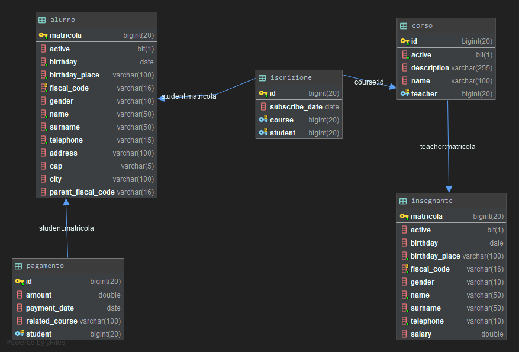
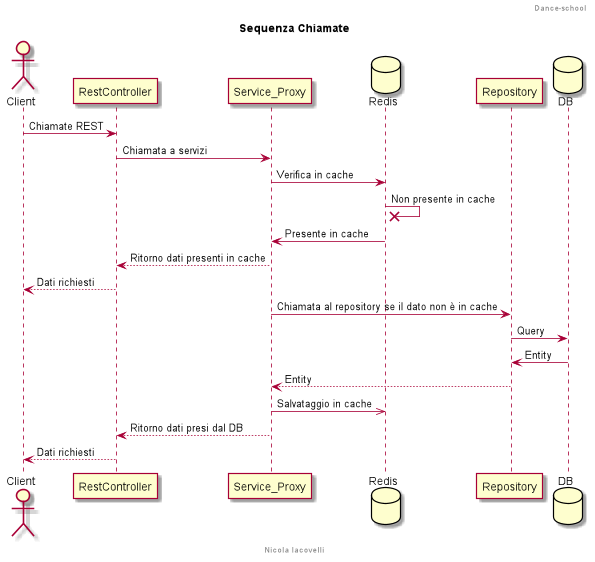
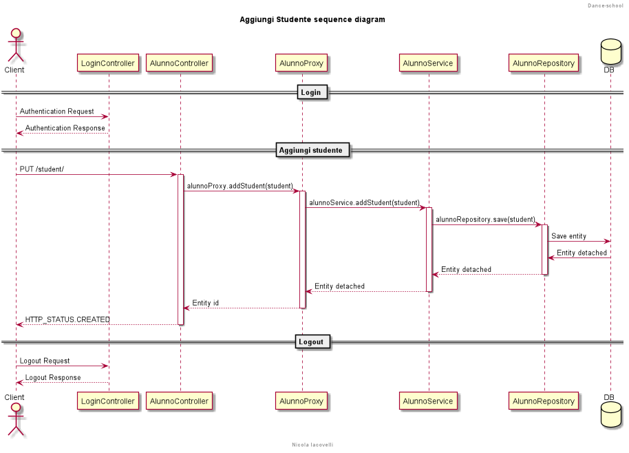
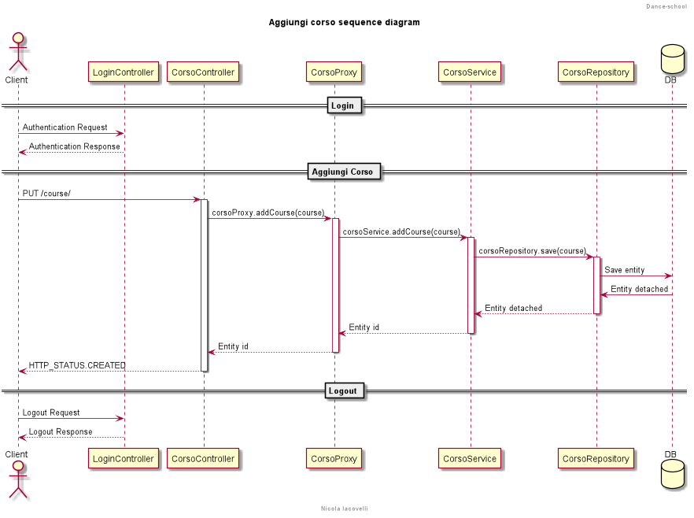
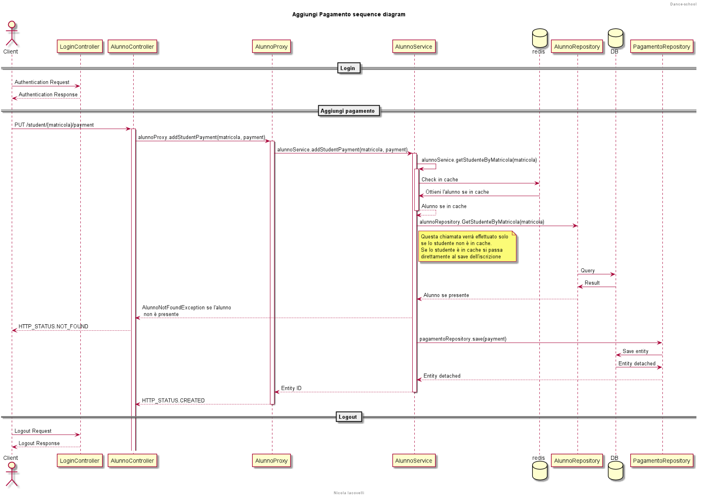
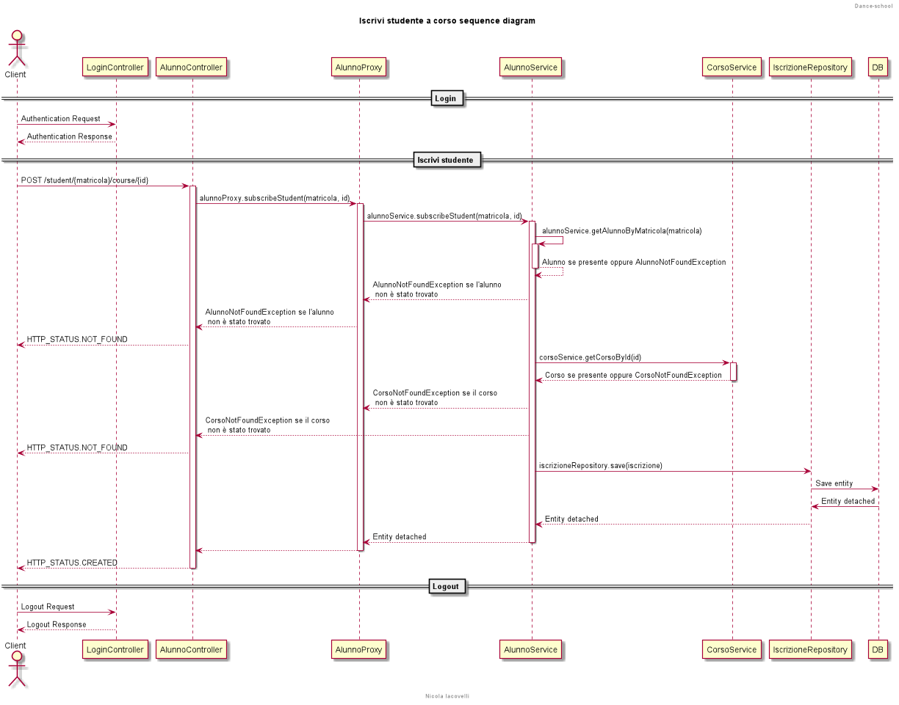

## Dance school 

This Rest API project is the back-end side of a dance school management. The
front-end side is [this](https://bitbucket.org/castopretorio/scuola-danza-android) android app. 

#### Description
The goal of this application is manage a dance school.

At the moment the application expose the API to do the following operation:
- Add new students or courses
- Edit existing students or courses
- Subscribe a student to a course
- Add a student's payment
- Track earnings and new subscriptions
- Get all active students or courses

#### Technology used 

- **Spring security** for API authentication with HTTP basic authentication
- **Spring cache & Redis** for application caching
- **Spring data & JPA** for data persistence
- **Firebase** for user authentication and custom roles

#### E/R Diagram

#### How it works

To access to API documentation you can use [swagger endpoint](https://dance-school-test.herokuapp.com/swagger-ui.html).

To test the API you can use those hosted on [Heroku](https://dance-school-test.herokuapp.com).

#### Sequence diagram

